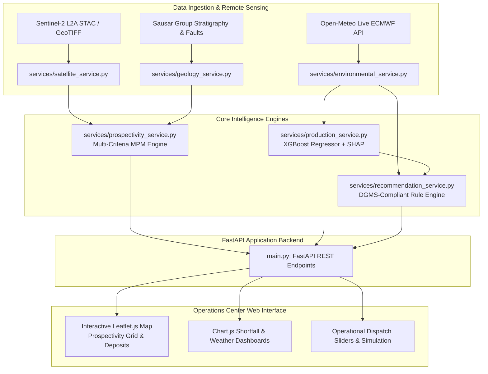

# GeoOre-AI: AI & Space Intelligence Platform for Manganese Prospectivity and Production Shortfall Mitigation

[](https://www.sih.gov.in/)
[](https://fastapi.tiangolo.com/)
[](https://xgboost.readthedocs.io/)
[](https://shap.readthedocs.io/)
[](https://sentinels.copernicus.eu/)

---

## 1. Executive Summary & SIH Problem Statement

**Problem Statement ID:** PS 26009  
**Ministry / Organization:** Ministry of Steel / MOIL (Manganese Ore India Limited)  
**System Name:** GeoOre-AI (OblivionSIH)  
**Target Region:** Balaghat–Sausar Manganese Belt, Madhya Pradesh / Maharashtra, India  

### Problem Description
Manganese mining operations in the Balaghat-Sausar belt face two interconnected operational and geological challenges:
1. **Unplanned Production Shortfalls:** Mine output is frequently disrupted by dynamic environmental conditions (monsoon rainfall, high bench soil moisture), equipment unavailabilities (shovel and haul truck breakdowns), and blasting schedule slips. Operations teams lack real-time predictive shortfall models and interpretable root-cause attribution to make proactive fleet re-dispatching decisions.
2. **Exploration Uncertainty & Prospectivity Mapping:** Traditional brownfield/greenfield mineral exploration requires labor-intensive field mapping. Integrating multi-spectral satellite remote sensing with regional lithostratigraphy and structural lineaments accelerates greenfield target prioritization.

### Objective & Solution
**GeoOre-AI** is an integrated AI/ML and Earth Observation platform engineered to:
* **Predict Daily Production Shortfall:** An XGBoost regressor predicts daily tonnage deficit and assigns operational risk tiers, accompanied by SHAP (SHapley Additive exPlanations) factor attributions.
* **Generate Multi-Day Production Trajectories:** Multi-day forecasts leverage live 7-day meteorological forecasts from Open-Meteo.
* **Map Manganese Ore Prospectivity:** A multi-criteria prospectivity model (MPM) fuses Sentinel-2 multispectral alteration indices (Hydrothermal and Ferrous Iron composite bands) with Sausar Group lithology, structural lineaments, and geophysical proxies.
* **Provide Prescriptive Decision Support:** Rule-based recommendation engine keyed to SHAP drivers, environmental thresholds, and Directorate General of Mines Safety (DGMS) guidelines.

---

## 2. Scientific Principles & Geological Context

### Remote Sensing & Surface Alteration Mapping
* **Sensors & Bands:** Sentinel-2 L2A optical/SWIR imagery (Band 4 Red, Band 8 NIR, Band 11 SWIR-1, Band 12 SWIR-2).
* **Vegetation Suppression:** Normalized Difference Vegetation Index ($\text{NDVI} = \frac{\text{B08} - \text{B04}}{\text{B08} + \text{B04}}$) masks out dense vegetation ($\text{NDVI} \ge 0.25$) to isolate exposed outcrops and bare ground.
* **Spectral Indices:**
  * **Hydrothermal Alteration Index:** $\frac{\text{SWIR-1}}{\text{SWIR-2}} = \frac{\text{B11}}{\text{B12}}$ (highlights hydroxyl-bearing minerals, clay alteration).
  * **Ferrous Iron Index:** $\frac{\text{SWIR-1}}{\text{NIR}} = \frac{\text{B11}}{\text{B08}}$ (captures gossans, iron/manganese oxide coatings).
  * **Composite Alteration Score:** Linear combination ($0.5 \times \text{Hydrothermal} + 0.5 \times \text{Ferrous Iron}$) over exposed soil surfaces.

> [!IMPORTANT]
> **Scientific Transparency Notice:**  
> Sentinel-2 optical and SWIR bands characterize **surface and near-surface spectral absorption properties only**. Satellite multispectral data **does not directly detect subsurface or underground manganese deposits**. All satellite-derived scores serve as surface exploration proxies and alteration anomalies requiring confirmation through geological mapping, geophysical surveys, and core drilling.

### Geological Evidence Fusion (MPM)
The mineral prospectivity mapping engine over the Balaghat pilot bbox ($21.78^\circ\text{N} - 21.84^\circ\text{N}, 80.15^\circ\text{E} - 80.22^\circ\text{E}$) applies a weighted multi-criteria evaluation:

$$\text{Prospectivity Index} = 0.35 \times S_{\text{lithology}} + 0.30 \times S_{\text{structure}} + 0.25 \times S_{\text{satellite}} + 0.10 \times S_{\text{geophysics}}$$

* **Lithology Weight (35%):** Prioritizes the Mansar Formation (primary host rock for gondite and braunite-bixbyite-pyrolusite ore bodies in the Sausar Group), followed by Chorbaoli and Sitasaongi formations.
* **Structure Weight (30%):** Proximity buffer to major tectonic structures (Bharweli-Ukwa shear zone, Balaghat syncline axial trace).
* **Satellite Alteration Weight (25%):** Normalized surface hydrothermal/ferrous iron composite index.
* **Geophysical Proxy (10%):** Litho-structurally inferred aeromagnetic/gravity anomaly proxy.

### Ground Truth Validation & Zero-Leakage Policy
* **Known MOIL Deposits:** Bharweli Mine, Miragpur Deposit, Ukwa Ore Belt, Ramrama Mine, and Tirodi Mining Complex are used **exclusively as hold-out ground-truth validation targets**.
* **Zero Circular Leakage:** Deposit locations are strictly excluded from model training features and weight calculations (`leakage_detected: False`).

---

## 3. System Architecture



---

## 4. AI/ML Production Shortfall Model

### Model Specification
* **Model Type:** Gradient Boosted Decision Trees (`XGBoostRegressor`)
* **Target:** `shortfall_tons` (Daily tonnage shortfall below target production)
* **Training Dataset:** 1,200 calibrated operational cycles (`data/processed/mine_operations_simulated.csv`)
* **Train/Test Split:** 80% train, 20% test ($n=240$), `random_state=42`
* **Evaluation Metrics (on calibrated simulation):**
  * **Mean Absolute Error (MAE):** $42.3\text{ tons}$
  * **Coefficient of Determination ($R^2$):** $0.972$

> [!NOTE]
> **Operational Data Disclosure:**  
> Training records represent calibrated engineering simulation data modeling open-cast and underground manganese mining operations. In production deployments, model weights must be retrained against real-time MOIL SCADA and fleet telemetry systems.

### Feature Space
| Feature Name | Type | Description |
|---|---|---|
| `planned_production` | Float | Target daily production quota (metric tons) |
| `active_shovels` | Integer | Count of operating loading shovels |
| `shovel_availability_pct` | Float | Percentage of planned shovel operating hours achieved |
| `haul_trucks` | Integer | Active haulage truck fleet count |
| `rainfall_mm` | Float | Daily cumulative precipitation |
| `soil_moisture_pct` | Float | Volumetric soil moisture percentage |
| `temperature_c` | Float | Ambient surface temperature |
| `blasting_delayed` | Binary (0/1) | Flag indicating delayed or cancelled blasting operations |

### Explainability (SHAP TreeExplainer)
For every real-time prediction or scenario simulation, `production_service.py` computes exact SHAP attributions using a pre-calculated background dataset ($n=150$). The top negative drivers are returned in `key_factors` and directly fed to the recommendation engine.

---

## 5. Repository Structure

```text
OblivionSIH/
├── data/
│   ├── anomalies.json                               # Map-compatible prospectivity cell features
│   ├── mine_logs.csv                                # Base historical mine log dataset
│   └── processed/
│       ├── environmental_cache.json                 # Offline fallback for Open-Meteo API
│       ├── manganese_prospectivity.geojson          # 36-cell MPM GeoJSON FeatureCollection
│       ├── manganese_spectral_anomalies.geojson     # Vectorized surface alteration polygons
│       ├── mine_operations_simulated.csv            # 1,200 calibrated operational training records
│       └── prospectivity_validation.json            # Empirical spatial validation metrics
├── models/
│   ├── model_metadata.json                          # Model versioning, hyperparams, & metrics
│   ├── shap_explainer.pkl                           # Pickled SHAP TreeExplainer
│   ├── shortfall_predictor.pkl                      # Trained XGBoost regressor model
│   └── shortfall_xgb.pkl                            # Legacy-compatible model alias
├── services/
│   ├── __init__.py                                  # Package initialization
│   ├── environmental_service.py                     # Live weather & ECMWF soil moisture ingestion
│   ├── geology_service.py                           # Sausar Group lithology, faults, & deposits
│   ├── production_service.py                        # XGBoost inference, SHAP, & multi-day forecast
│   ├── prospectivity_service.py                     # Weighted MPM engine & spatial validation
│   ├── recommendation_service.py                    # Dispatch action generator & DGMS safety rules
│   └── satellite_service.py                         # Sentinel-2 multispectral index processing
├── templates/
│   └── index.html                                   # Web dashboard UI (Leaflet.js + Chart.js)
├── main.py                                          # FastAPI backend application
├── pipeline.py                                      # Standalone satellite index calculation pipeline
├── train_ml.py                                      # ML training pipeline script
├── validate_all.py                                  # Full system validation and stress testing script
├── test_pipeline_e2e.py                             # End-to-end API & integration test suite
├── SIH_REQUIREMENTS.md                              # SIH PS 26009 requirements traceability matrix
└── requirements.txt                                 # Python package dependencies
```

---

## 6. Installation & Quick Start

### Prerequisites
* Python 3.9, 3.10, or 3.11
* Modern web browser (Chrome, Firefox, Edge)

### Setup Instructions

1. **Clone the Repository & Navigate to Folder:**
   ```bash
   git clone https://github.com/Atharvajoshi006/OblivionSIH.git
   cd OblivionSIH
   ```

2. **Create and Activate a Virtual Environment:**
   ```bash
   # Windows (PowerShell)
   python -m venv .venv
   .venv\Scripts\Activate.ps1

   # Linux / macOS
   python3 -m venv .venv
   source .venv/bin/activate
   ```

3. **Install Dependencies:**
   ```bash
   pip install -r requirements.txt
   ```

4. **Launch the FastAPI Server:**
   ```bash
   python main.py
   ```
   *The server starts at `http://127.0.0.1:8000`.*

5. **Access the Application:**
   * **Interactive Web Dashboard:** [http://127.0.0.1:8000/](http://127.0.0.1:8000/)
   * **Interactive OpenAPI/Swagger Docs:** [http://127.0.0.1:8000/docs](http://127.0.0.1:8000/docs)
   * **ReDoc Documentation:** [http://127.0.0.1:8000/redoc](http://127.0.0.1:8000/redoc)

---

## 7. REST API Documentation

| Endpoint | Method | Description |
|---|---|---|
| `/` | `GET` | Serves the web-based mine operations dashboard. |
| `/api/predict-shortfall` | `POST` | Predicts daily production shortfall, risk tier, SHAP drivers, and actionable recommendations. Automatically pulls live weather if parameters are omitted. |
| `/api/simulate` | `POST` | Scenario planning endpoint for testing fleet and weather variables. |
| `/api/prospectivity/geojson` | `GET` | Returns GeoJSON FeatureCollection of the 36-cell mineral prospectivity grid with scores and sub-criteria. |
| `/api/anomalies` | `GET` | Returns map-ready anomaly polygons for Leaflet visualization. |
| `/api/prospectivity/validation` | `GET` | Returns spatial concordance report against known MOIL manganese deposits with circular leakage check. |
| `/api/environmental-current` | `GET` | Fetches live weather, ECMWF soil moisture, and 7-day forecast from Open-Meteo for the Balaghat region. |
| `/api/satellite/spectral-summary`| `GET` | Returns statistical summary and metadata of Sentinel-2 multispectral processing. |
| `/api/geology/deposits` | `GET` | Returns coordinates, formation data, and reserve classifications of known deposits. |

### Example Request (`/api/predict-shortfall`):
```json
{
  "planned_production_tons": 1200.0,
  "active_shovels": 4,
  "shovel_availability_pct": 75.0,
  "haul_trucks": 8,
  "rainfall_mm": 25.0,
  "soil_moisture_pct": 68.0,
  "temperature_c": 29.0,
  "blasting_delayed": 1
}
```

---

## 8. Validation & Testing

The system includes automated validation suites to ensure scientific consistency, zero data leakage, and API robustness:

### 1. Full Scientific Validation & Stress Testing
Executes prospectivity background contrast validation, 7 production stress scenarios, and a scientific honesty audit:
```bash
python validate_all.py
```

### 2. End-to-End API Test Suite
Executes end-to-end HTTP tests against all endpoints using `TestClient`:
```bash
python test_pipeline_e2e.py
```

### 3. Retraining the ML Pipeline (Optional)
Generates simulated operational records, retrains the XGBoost regressor, computes SHAP background values, and saves model artifacts:
```bash
python train_ml.py
```

---

## 9. Limitations & Future Scope

### Current Limitations
1. **Calibrated Simulation Data:** Operational training data is calibrated to standard mining metrics; live industrial deployment requires integration with MOIL fleet management APIs.
2. **Pilot Bounding Box:** High-resolution prospectivity mapping is currently generated over a $7\text{ km} \times 6\text{ km}$ pilot area centered on the Bharweli belt. Regional expansion across the full 150 km Sausar belt requires scaled raster processing.
3. **Geophysical Proxy:** Magnetic/gravity layers are litho-structurally inferred based on published GSI maps rather than raw, unclassified airborne survey rasters.

### Future Roadmap
* Direct IoT/SCADA connector for automated shovel/dumper payload telemetry.
* Automated ingestion of Sentinel-1 SAR imagery for all-weather soil moisture and subsidence monitoring.
* Drillhole core assay database integration for 3D block model interpolation.
* Subsurface 3D seismic & electrical resistivity inversion pipeline.

---

## 10. License & Acknowledgments
Developed for **Smart India Hackathon (SIH) 2026** under Problem Statement **PS 26009**.  
Data acknowledgments: Geological Survey of India (GSI) Bhukosh portal, Copernicus Sentinel-2 / European Space Agency (ESA), and Open-Meteo ECMWF.
